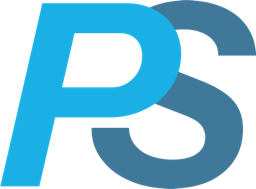
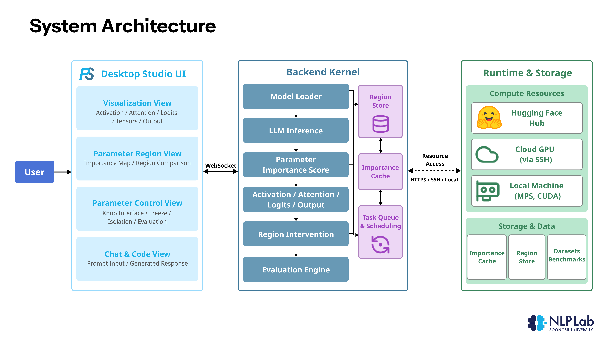
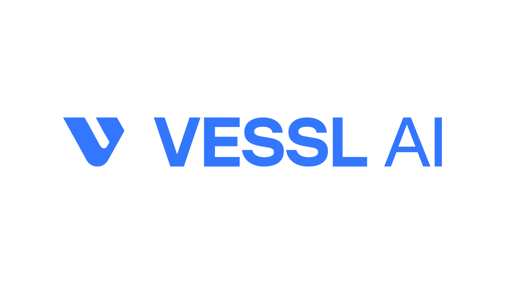

<p align="center">
  
</p>

<h1 align="center">Parametric Studio</h1>

An interactive desktop app for exploring the **Coding Spot** — the small top-k% of a language
model's parameters (ranked by `|gradient × parameter|` importance on code) that carry its coding
ability. Zero that spot and coding collapses while general ability barely moves; equal-size random
or bottom-ranked controls do neither. Parametric Studio turns that finding into a hands-on tool:
load a model, locate its coding spot, ablate or train it, and watch code vs. general performance
change live.

This is the demo artifact. The desktop app is self-contained — it bundles the inference kernel and,
on first run, installs the Python dependencies it needs.

## What you can do

- **Load a model** (e.g. `Qwen/Qwen2.5-Coder-1.5B-Instruct`) — weights download from Hugging Face on
  first use.
- **Locate the coding spot** — top-k% importance mask per parameter, with a layer × module heatmap.
- **Ablate a region** — zero the spot vs. matched random / bottom controls and compare code PPL,
  general PPL, and HumanEvalPack pass@1.
- **Region-aware training** — full, spot-freeze, spot-only, or LoRA; reversible.
- **Evaluate** — HumanEvalPack-Python pass@1 on the current (clean or damaged) model.

## Install (end user)

1. Install **Python 3.10+** and make sure it is on your `PATH`.
2. Download the installer for your platform from the repository's **Releases** (or the
   `studio-build` CI run artifacts):
   - **Windows** — `Parametric Studio_*_x64-setup.exe`
   - **macOS** (Apple Silicon) — `Parametric Studio_*.dmg`
3. Run it. On **first launch** the app checks for its kernel dependencies. If they are missing, a
   **setup panel** appears: pick a detected Python (or Browse to one) and click **Install
   dependencies** — it runs `pip install -r requirements-studio.txt` and restarts the kernel
   automatically. (The Windows installer also attempts this at install time.)

> The kernel needs `torch`, `transformers`, `datasets`, `fastapi`, `uvicorn`, `websockets`. A GPU is
> optional — the kernel auto-selects MPS (Apple), CUDA, or CPU. macOS builds are unsigned: right-click
> → **Open** the first time.

## Run from source (development)

The app is **two processes**: the Python **kernel** (WebSocket API) and the **web** frontend. This
is the fastest way to try it without building an installer.

**1. Install the kernel dependencies** (once):

```bash
cd parametric-studio
pip install -r requirements-studio.txt
```

**2. Start the backend kernel** — serves the API on `127.0.0.1:8000`. Run this from the repo root
(the folder that contains `parametic_studio/`), using the Python where you installed the deps:

```bash
# 백엔드 실행
cd parametric-studio
python -m parametic_studio.api
# 예: conda 파이썬이면  /opt/conda/bin/python -m parametic_studio.api
```

**3. Start the web frontend** — in a **second terminal**:

```bash
# 웹 실행
cd parametric-studio/studio_web
npm install
npm run dev -- --host 0.0.0.0
```

Open the URL it prints (default **http://localhost:5173**). The frontend auto-connects to the kernel
at `ws://127.0.0.1:8000/ws` — when the status shows connected, use **+ Model** in the UI to load a
model and start exploring.

> Prefer the **native desktop window** instead of a browser? Skip steps 2–3 and run one command —
> it spawns the kernel and opens the app together:
> ```bash
> cd parametric-studio/studio_web
> npm install
> npm run tauri dev
> ```

## Build from source

Requires **Node 18+**, **Rust**, and the [Tauri v2 prerequisites](https://v2.tauri.app/start/prerequisites/).

```bash
cd studio_web
npm ci
npm run tauri build
```

Output: `studio_web/src-tauri/target/release/bundle/` (`.dmg`/`.app` on macOS, `.exe`/`.msi` on
Windows). CI (`.github/workflows/studio-build.yml`) builds both platforms via `workflow_dispatch`.

## Architecture

<p align="center">
  
</p>

Three tiers, connected over one WebSocket:

- **Desktop Studio UI** (Tauri + React) — Visualization (activation / attention / logits / tensors /
  output), Parameter Region (importance map, region comparison), Parameter Control (knob, freeze,
  isolation, evaluation), and Chat & Code views.
- **Backend Kernel** (Python) — Model Loader → LLM Inference → Parameter Importance Score →
  activation/attention/logits/output → Region Intervention → Evaluation Engine, backed by a Region
  Store, an Importance Cache, and a task scheduler.
- **Runtime & Storage** — compute on the local machine (MPS / CUDA), a Cloud GPU over SSH, or the
  Hugging Face Hub for weights; regions, importance caches, and dataset benchmarks are persisted.

## How it works

Parametric Studio is a **Tauri v2** shell (Rust + React/TypeScript) that owns a Python **kernel**:

- On launch the Rust shell spawns `python -m parametic_studio.api` — a FastAPI + WebSocket server on
  `127.0.0.1:8000`. The kernel source (`parametic_studio/`) is bundled into the app as a resource, so
  no path configuration is needed.
- The React frontend (`studio_web/`) connects over WebSocket and drives every operation — model load,
  spot location, ablation, training, evaluation — streaming results back live.
- The kernel's lifecycle is coupled to the app window: it is killed on exit.

For pointing the app at a **remote GPU kernel** over SSH instead of a local Python, see
[docs/REMOTE_KERNEL.md](docs/REMOTE_KERNEL.md).

## Layout

```
parametic_studio/         Python inference kernel (FastAPI + WebSocket; self-contained)
studio_web/               Tauri v2 desktop app (Rust shell + React frontend)
requirements-studio.txt   Kernel dependencies
```

## Paper

Kim et al., *Exploring the Coding Spot: Understanding Parametric Contributions to LLM Coding
Performance.*

## License

Licensed under [**CC BY 4.0**](LICENSE) (Creative Commons Attribution 4.0 International) — you are
free to share and adapt this work for any purpose, including commercially, with appropriate
attribution.

## Acknowledgments

This work was supported by **[VESSL AI](https://vessl.ai)**, which provided the cloud GPU compute
used for Parametric Studio's model analysis and remote-kernel workloads.

<p align="center">
  
</p>

Developed by **NLP Lab, Soongsil University**.
